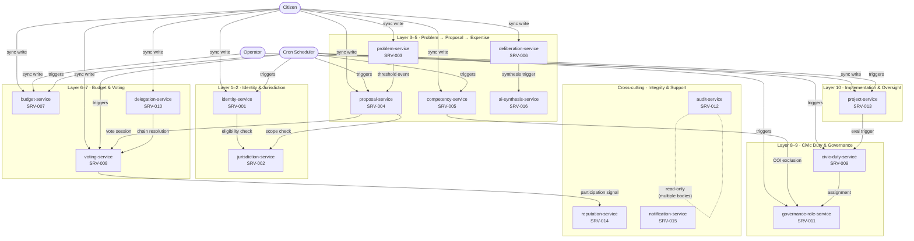
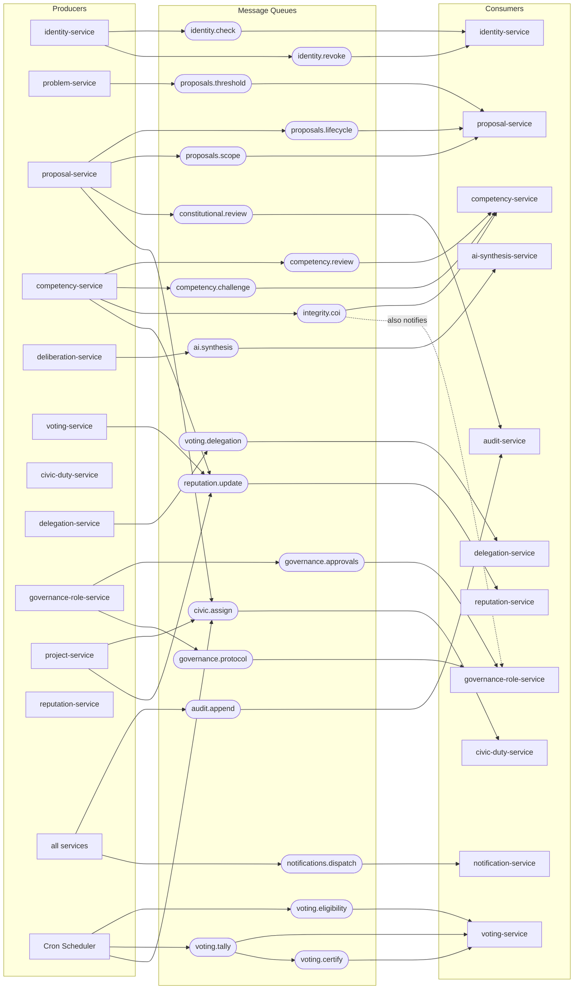
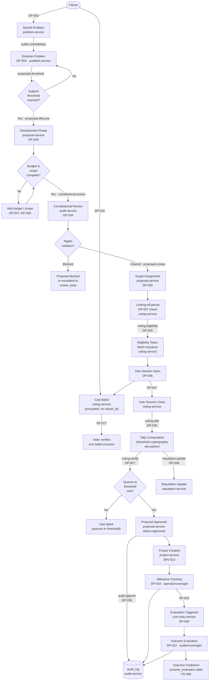
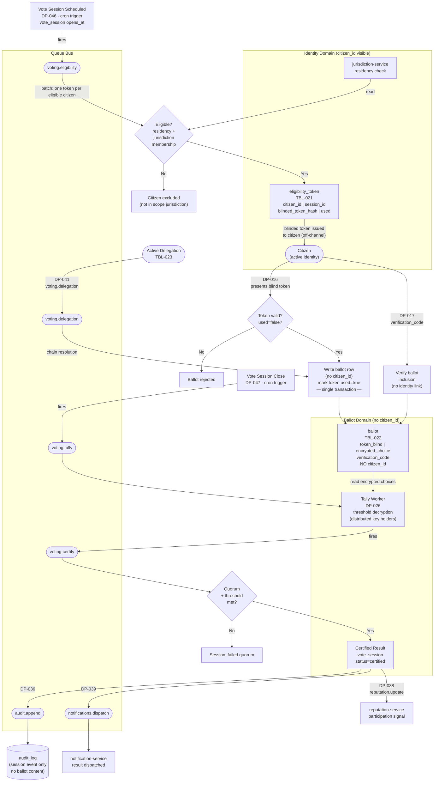
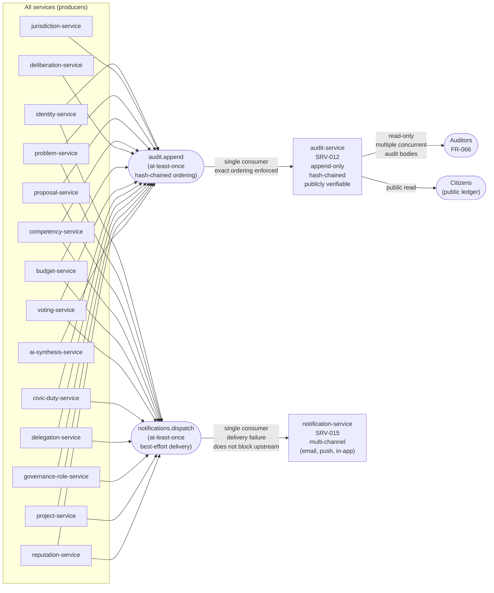

## Overview

Four diagrams describe the runtime topology of the system. The first shows how services are organized by layer and which queues they share. The second shows the queue bus in detail: every producer–consumer pair. The third traces the full governance lifecycle from problem submission to project outcome. The fourth isolates the voting pipeline and its cryptographic identity–ballot separation.

All sync operations flow directly from an actor to a service. All async operations flow through a named queue. Cron jobs fire from the scheduler into service workers or directly into queues.

---

## 1. Service layer overview

Services are organized across five independent layers. Arrows show the primary direction of data flow; every service additionally writes to `audit.append` and `notifications.dispatch` (omitted here for readability — shown in diagram 2).

---

## 2. Queue bus topology

Every named queue in the system, with its producers (→ Q) and consumers (Q →). The `audit.append` and `notifications.dispatch` queues are consumed by exactly one service each; all other services produce to them.

---

## 3. Governance lifecycle flow

The end-to-end pipeline from problem submission through project outcome evaluation. Gates are shown as diamonds; async queue hops are labeled.

---

## 4. Voting pipeline — cryptographic identity–ballot separation

Zoomed-in view of the voting flow showing how eligibility and ballot are kept in separate cryptographic domains (ADR-002). The bridge is a blind-signed one-time token that cannot be used to link a citizen to a ballot.

---

## 5. Integrity bus

Every service emits to two shared queues. This diagram shows all services as producers of `audit.append` and `notifications.dispatch`, and the single consumer of each.

