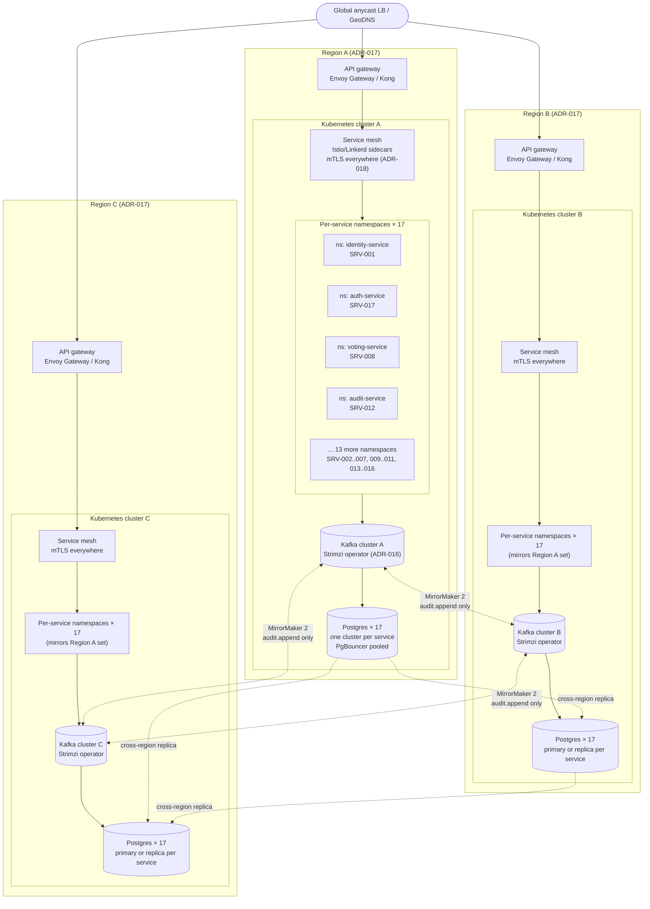
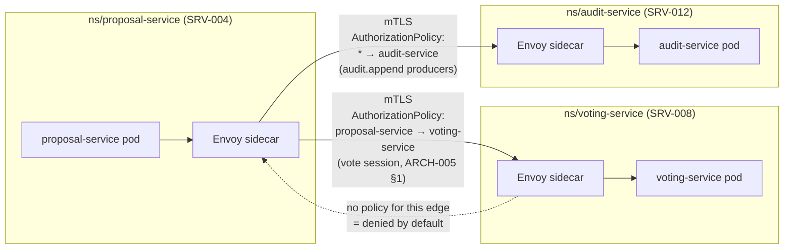
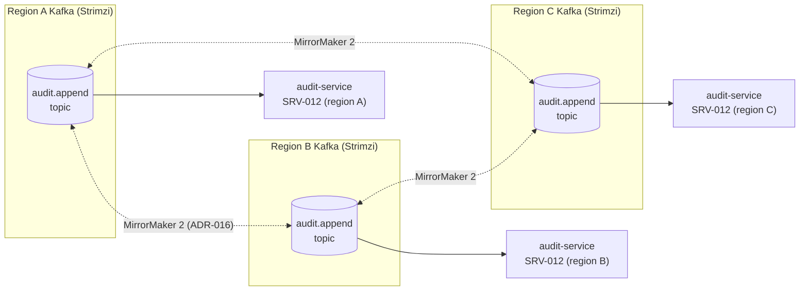

## Overview

This document describes the runtime deployment topology that realizes ADR-015 (microservices on Kubernetes), ADR-016 (Kafka backbone), ADR-017 (multi-region autoscaling), and ADR-018 (zero-trust mesh identity). It maps the logical service and queue topology in ARCH-005 onto physical infrastructure: which cluster a pod runs in, which namespace isolates it, how traffic reaches it, how it talks to its peers, where its data lives, and how all of that scales, deploys, and rotates secrets. All 17 services (SRV-001 through SRV-017 — identity, jurisdiction, problem, proposal, competency, deliberation, budget, voting, civic-duty, delegation, governance-role, audit, project, reputation, notification, ai-synthesis, and auth) are deployed identically across every region; no service is region-pinned.

---

## 1. Cluster layout

One Kubernetes cluster per region, three regions total per ADR-017. Every one of the 17 services gets its own namespace in every cluster — namespace boundary equals service boundary equals `NetworkPolicy` boundary. A pod in `ns/voting-service` cannot reach a pod in `ns/budget-service` except through the service mesh path explicitly allowed by an `AuthorizationPolicy` (§3); default-deny `NetworkPolicy` objects at the namespace boundary enforce this at the CNI layer as well, so isolation does not depend on the mesh alone.

| Region | Cluster | Namespaces | Kafka | Postgres |
|--------|---------|-----------|-------|----------|
| Region A | `k8s-region-a` | 17 (SRV-001..SRV-017) | Kafka cluster A (Strimzi) | 17 Postgres clusters, primaries for the region's write share |
| Region B | `k8s-region-b` | 17 (SRV-001..SRV-017) | Kafka cluster B (Strimzi) | 17 Postgres clusters, primary or replica per ADR-017 |
| Region C | `k8s-region-c` | 17 (SRV-001..SRV-017) | Kafka cluster C (Strimzi) | 17 Postgres clusters, primary or replica per ADR-017 |

---

## 2. Ingress and edge

The global anycast load balancer / GeoDNS routes each client to the nearest healthy region and fails over to the next-nearest on region loss. Within a region, traffic lands on a per-region API gateway — an open-source gateway such as Envoy Gateway or Kong — which performs, in order: TLS termination; coarse per-IP and per-citizen-token rate limiting (the fine-grained per-operation limits live in each service); JWT signature verification against auth-service's (SRV-017) published public keys, rejecting anything unsigned or expired before it reaches the mesh. Only after those three checks does the gateway hand the request off into the service mesh ingress for the target namespace. The gateway never terminates business logic and never talks directly to a database or Kafka — it is a pure edge, replaceable independently of the services behind it.

---

## 3. Service mesh

Every pod in every namespace runs an Istio or Linkerd sidecar per ADR-018, and mutual TLS is mandatory mesh-wide — plaintext pod-to-pod traffic is rejected at the sidecar, not merely discouraged. The mesh's default posture is deny-all; connectivity between two services exists only where an `AuthorizationPolicy` explicitly grants it. Those policies are generated to match ARCH-005 §1/§2's producer–consumer table exactly — one `AuthorizationPolicy` per edge in that table, naming source namespace, destination namespace, and (where applicable) the specific queue topic the edge corresponds to. A service with no listed edge to another service has no path to it, at either the mesh or the `NetworkPolicy` layer (§1).

---

## 4. Event backbone

Each region runs its own Kafka cluster deployed and managed via the Strimzi Kubernetes operator, per ADR-016. All queues from ARCH-005 §2 (`identity.check`, `proposals.threshold`, `voting.tally`, `audit.append`, `notifications.dispatch`, and the rest) exist independently in each region's cluster, and a service only produces to and consumes from its own region's cluster in normal operation — there is no cross-region hop on the write or consume path for ordinary traffic. The single exception is `audit.append`: it is mirrored across all three regions via MirrorMaker 2 (or an equivalent Kafka-to-Kafka replicator), so the append-only, hash-chained public audit log (ARCH-005 §5) survives the total loss of any one region rather than losing that region's slice of history.

---

## 5. Data layer

Per ADR-015, each of the 17 services owns exactly one Postgres cluster — no shared database, no cross-service joins at the storage layer. Per ADR-017, each service's Postgres cluster runs as one primary plus two cross-region replicas, placing a copy of every service's data in every region regardless of where its primary currently sits. Each service connects to its own cluster through a PgBouncer pool colocated in the same namespace, keeping connection counts bounded as pods scale horizontally.

All read operations named in AUTH-009's authorization matrix are served from a replica rather than the primary, so governance writes never contend with read traffic for primary capacity:

| Read operation (AUTH-009) | Served from |
|---------------------------|-------------|
| `audit_log:read` | Replica (any region) |
| `governance_data:read` | Replica (any region) |
| Ledger view | Replica (any region) |

Writes always route to the current primary for that service, regardless of which region received the request; a write in a non-primary region crosses the mesh to the primary's region rather than being served locally.

---

## 6. Caching

Each region runs a per-region Redis cluster in front of the highest-read services — proposal-service (SRV-004), audit-service (SRV-012), and jurisdiction-service (SRV-002) — for public governance-data reads. Caching uses cache-aside: a miss reads through to the service's Postgres replica (§5) and populates the cache; invalidation is event-driven, triggered off the region-local `audit.append` stream (§4) rather than a TTL guess, so a cached read reflects the latest committed governance event within one consumer-lag interval. Ballot content and session data are never cached, in any form, at any layer — every read of a ballot or an active voting session goes to the database directly, consistent with the identity–ballot separation in ARCH-005 §4.

---

## 7. Autoscaling

Three autoscalers operate at different layers:

| Layer | Mechanism | Trigger |
|-------|-----------|---------|
| Sync request-serving pods | Horizontal Pod Autoscaler (HPA) | CPU / memory utilization |
| Async queue-consumer workers | KEDA | Kafka consumer-lag on the worker's subscribed topic(s) |
| Node pool | Cluster autoscaler (or Karpenter) | Unschedulable pods from either of the above |

HPA covers the request/response path — services fronted by the API gateway (§2) — where load correlates with CPU and memory. KEDA covers everything that drains a Kafka topic — proposal lifecycle workers, tally workers, notification dispatch — where load correlates with backlog depth, not resource usage; a worker sitting idle with zero lag scales to zero, and a growing backlog on `voting.tally` during a close-of-session spike scales workers up ahead of CPU saturation. The cluster autoscaler (or Karpenter) provisions and removes nodes underneath both, per region, so namespace-level scaling decisions are not capped by a fixed node pool size.

---

## 8. Deployment pipeline

Argo CD syncs each cluster's state from this spec repository via GitOps — the repository is the source of truth for what runs, not a separate deployment system's internal state. Terraform provisions the clusters and networking (VPCs, cluster creation, Kafka/Postgres infrastructure); Helm charts, one per service, define what runs inside each namespace. A change to a service's Helm values or a Terraform module is the only path to a production change; there is no out-of-band `kubectl apply`.

Rollouts use mesh-based progressive delivery (canary): a new version receives a small percentage of mesh traffic in a namespace, with automatic rollback tied to the SLO burn-rate alerting defined in ARCH-008. A canary that burns its error budget faster than the configured rate is rolled back automatically, before it reaches full traffic, without waiting for a human to notice the dashboard.

---

## 9. Secrets

Secrets — database credentials, Kafka credentials, JWT signing keys, third-party API keys — are managed by the External Secrets Operator, backed by a KMS-backed vault (HashiCorp Vault or an equivalent cloud-KMS-backed option). No secret is ever stored unencrypted in a Kubernetes `Secret` object or committed to git in plaintext; the Kubernetes `Secret` resources that exist are synced copies of vault-held values, encrypted at rest by the underlying KMS. Database credentials rotate automatically on a fixed schedule, with PgBouncer (§5) and the External Secrets Operator coordinating so a rotation does not drop in-flight connections.
